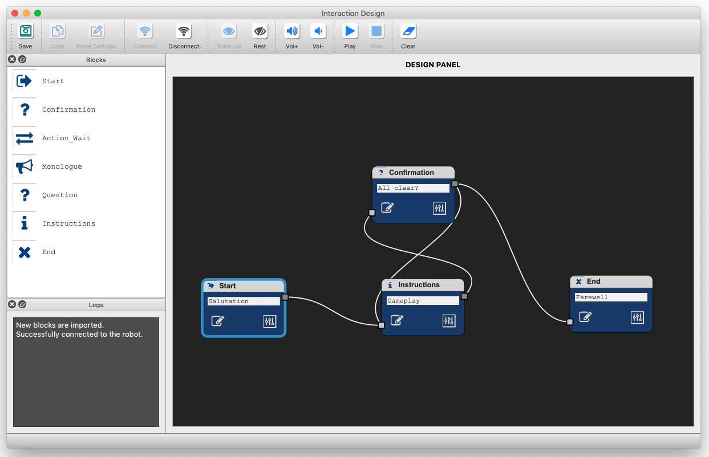

# Design Tool for Multi-Modal Robot Communication

This project provides a prototyping tool for designing communicative (expressive) behaviors for social robots. The current version is compatible with the [Pepper Robot](https://www.ald.softbankrobotics.com/en/robots/pepper).

The tool was successfully tested on ***MAC*** and ***Linux***.

## Requirements

To use the tool you need to do the following:

**A.** Install the requirements as described in [Section I](#i-linux-installation-guide).

**B.** Clone the repository (e.g., in the Documents folder)

`cd ~/Documents`

`$ git clone https://github.com/ES-TUDelft/robot-interaction-tool.git`

**C.** Launch the interface as follows:

`cd ~/Documents/robot-interaction-tool`

`$ python main.py`

***Note***: This repository is being updated on a regular basis. Use ***git pull*** to integrate the latest changes.

  

---

## I. Installation Guide

To use the tool on Linux, Mac or Windows platforms, refer to the [installation document](https://github.com/ES-TUDelft/robot-interaction-tool/blob/master/docs/INSTALLATION.md) found in [docs/INSTALLATION.md](https://github.com/ES-TUDelft/robot-interaction-tool/blob/master/docs/INSTALLATION.md)

---

## II. Setting up Spotify

* To [setup Spotify](https://github.com/ES-TUDelft/robot-interaction-tool/blob/master/docs/INSTALLATION.md#ii-setting-up-spotify), refer to the [installation document](https://github.com/ES-TUDelft/robot-interaction-tool/blob/master/docs/INSTALLATION.md).

* Once you're connected to **Spotify**, you'll be able to see your playlists and tracks.

* To play a song (e.g., using the test button or the mini-player panel in the main interface), you will need an active device (i.e., a Spotify Player) that is running on either your browser or PC/Phone.

* ***NOTE:*** When the player is not able to start a song, it means the device is not active. Just refresh your Spotify Player browser or the desktop app. 

---

## III. User Manual: 

A [user manual](https://github.com/ES-TUDelft/robot-interaction-tool/blob/master/docs/user-manual/MANUAL.md) describing the main features of the UI can be found in [docs/user-manual/MANUAL.md](https://github.com/ES-TUDelft/robot-interaction-tool/blob/master/docs/user-manual/MANUAL.md).

---

## IV. Quick Start

To quickly test the tool, import one of the [examples](https://github.com/ES-TUDelft/robot-interaction-tool/tree/master/examples) and run the simulator or connect to a physical robot and test the interaction.

---

## V. Citation
Please cite our work when you use this tool in your studies:

    @inproceedings{Saad2020,
      author = {Elie Saad and Joost Broekens and Mark A. Neerincx},
      booktitle = {InPress},
      title = {Design Tool for Prototyping Multi-Modal Robot Communication},
      year = {2020}
    }
