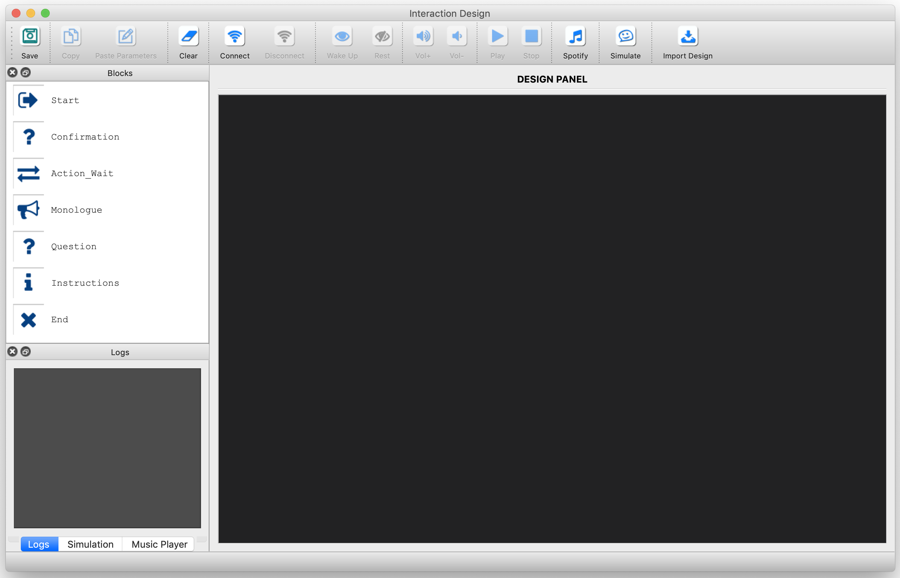

In this document we go over the installation of the required libraries and setting up Spotify for successfully running the prototyping tool.

* First, clone the repository (e.g., to your Documents):

`$ cd Documents`

`$ git clone https://github.com/ES-TUDelft/robot-interaction-tool.git`

==> if you don't have git, install it from: https://git-scm.com/downloads

* Then, proceed with the installation guide depending on your PC's OS.

---

## Content
**I.** [Linux Installation Guide](#i-linux-installation-guide)

**II.** [Windows Installation Guide](#ii-windows-installation-guide)

**III.** [MAC Installation Guide](#iii-mac-installation-guide)

**IV.** [Setting up Spotify](#iv-setting-up-spotify)

**V.** [Known Installation Issues](#v-known-installation-issues)

---

# I. Linux Installation guide

## I.1. Python 2.7

* Install [Python 2.7](https://www.python.org/downloads/release/python-2717/) 

## I.2. NAOqi for Python

* Install [PYNAOqi 2.5 for Python](http://doc.aldebaran.com/2-5/dev/python/install_guide.html):
   
   * Go to: [https://community.ald.softbankrobotics.com/en/resources/software/language/en-gb](https://community.ald.softbankrobotics.com/en/resources/software/language/en-gb)
   * Open an account, if you don't have one
   * In the 'Software' page, scroll down to: **Pepper SDKs and documentation 2.5.5** and download **Python 2.7 SDK 2.5.5 Linux 64** (or go to [https://community.ald.softbankrobotics.com/en/resources/software/pepper-sdks-and-documentation-255](https://community.ald.softbankrobotics.com/en/resources/software/pepper-sdks-and-documentation-255) and click on the download link)

* Open a terminal and do the following:

`$ cd ~/Downloads`

`$ tar -xvzf pynaoqi-python2.7-2.5.5.5-linux64.tar`

`$ mv pynaoqi-python2.7-2.5.5.5-linux64 ~/Documents`

* Tip: add NAOqi to the PYTHONPATH by appending the following line to the end of the *.bashrc* file as follows: *(change naoqi path to where you stored **pynaoqi-python2.7-2.5.5.5-linux64**)*

`$ vim ~/.bashrc`

`export PYTHONPATH=${PYTHONPATH}:/path_to_pynaoqi-sdk-2.5.5.5-linux64/lib/python2.7/site-packages`

`$ source ~/.bashrc`

* Test that NAOqi is imported correctly:

`$ python`

`>>> import naoqi`

* In case of errors, verify your PYTHONPAH or check Softbank documentation at: [http://doc.aldebaran.com/2-5/dev/python/install_guide.html](http://doc.aldebaran.com/2-5/dev/python/install_guide.html)

## I.3. Install PIP and other dependencies

* Open a terminal

`$ sudo apt-get update`

`$ sudo apt-get install -y python-pip python-dev`

* Now use pip to install the project requirements:

`$ pip install -r requirements.txt`

    * If you get errors related to the "qi" library, verify that NAOqi is in the PYTHONPATH.
    

## I.4. Install qt513

* Open a terminal:

`$ sudo add-apt-repository ppa:beineri/opt-qt-5.13.2-bionic`

`$ sudo apt-get update`

`$ apt-get install -y build-essential libgl1-mesa-dev qt513-meta-minimal qt513svg`

==> Qt should be now in: /opt/qt513

## I.5. Install SIP 4.19.x

* Go to https://www.riverbankcomputing.com/software/sip/download and select **sip-4.19.21**

* Open a terminal and cd to the downloads folder (or to where you dowloaded sip)

`$ cd Downloads`

`$ tar -xvzf sip-4.19.21.tar.gz`

`$ cd sip-4.19.21`

`$ python configure.py --sip-module=PyQt5.sip`

`$ make -j 4`

`$ sudo make install`

`$ pip list`

==> you should see PyQt5-sip in the list

## I.6. Install PyQt5

* Dowload **PyQt5-5.13.2.tar.gz** from (https://www.riverbankcomputing.com/software/pyqt/download5)

* Open a terminal and cd to the downloads folder (or to where you dowloaded PyQt)

`$ cd Downloads`

`$ tar -xvzf PyQt5-5.13.2.tar.gz`

`$ cd PyQt5-5.13.2`

`$ LD_LIBRARY_PATH=/opt/qt513/lib python configure.py --confirm-license --disable=QtNfc --qmake=/opt/qt513/bin/qmake QMAKE_LFLAGS_RPATH=`

`$ make -j 4`

`$ sudo make install`

* If you see **errors** during the install procedure, try to address them OR repeat steps 4-6 (i.e., and make sure there are no errors after performing each step).

`$ pip list | grep 'PyQt5'`

==> you should see PyQt5 in the results

* To make sure that PyQt5 is installed correctly, try the following:

`$ python`

`>>> from PyQt5 import QtWidgets`

===> If you have errors, this means that PyQt5 is not installed correctly! Check **Section V** for known issues!

## I.7. Launch the Interaction Tool

Once you finish installing all the requirements, open a terminal and cd to where you saved the tool:

`$ cd robot-interaction-tool`

`$ python main.py`

The user interface should run now, good luck!

  

---

# II. Windows Installation guide

*These steps are to guide throught the installation process. If you encounter some errors, try to modify the default paths to fit what you have on your machine!*

## II.1. Visual Studio

* Install [Visual Studio](https://visualstudio.microsoft.com/vs/community/)

   * In the Workloads, select "Python development" and enable "Python native development tools" only
   
* Install [Microsoft Visual C++ Redistributable for Visual Studio (x86)](https://support.microsoft.com/en-us/help/2977003/the-latest-supported-visual-c-downloads)
   
* Optional: Install [Microsoft Visual C++ Compiler for Python 2.7](https://www.microsoft.com/en-us/download/details.aspx?id=44266)

## II.2. Python 2.7

* Install [Python 2.7 32-bits](https://www.python.org/downloads/release/python-2717/) (select "Windows x86 MSI installer")

* Verify that your system recognizes python: open a command prompt and try

`$ python`

==> **Note**: you may need to manually add python to your system **PATH** by editing the system environment variables and appending: C:\Python27; C:\Python27\Lib\site-packages; C:\Python27\Scripts to the Path variable.

## II.3. NAOqi for Python

* Download Pynaoqi (pynaoqi-python2.7-2.5.5.5-win32-vs2013) for Windows:
   * Go to: [https://community.ald.softbankrobotics.com/en/resources/software/language/en-gb](https://community.ald.softbankrobotics.com/en/resources/software/language/en-gb)
   * Open an account, if you don't have one
   * In the 'Software' page, scroll down to: **Pepper SDKs and documentation 2.5.5** and download **Python 2.7 SDK 2.5.5 Win 32 Binaries** (or go to [https://community.ald.softbankrobotics.com/en/resources/software/pepper-sdks-and-documentation-255](https://community.ald.softbankrobotics.com/en/resources/software/pepper-sdks-and-documentation-255) and click on the download link for Windows)

* Follow the installation instructions (for Windows) from SoftbankRobotics http://doc.aldebaran.com/2-5/dev/python/install_guide.html#python-install-guide
   * extract pynaoqi (downloaded in the previous step) to your Documents folder (or somewhere else)
   * modify your user environment variables by adding the following:
    
         Variable name: PYTHONPATH
         Variable value: C:\Users\YOUR_USER_NAME\Documents\pynaoqi-python2.7-2.5.5.5-win32-vs2013\lib; C:\Python27\Lib\site-packages
   
* Open a new command prompt and try the following:

`$ python`

`>>> import naoqi`

## II.4. Install PIP and other dependencies

* Open a command prompt and install pip:

`$ curl https://bootstrap.pypa.io/get-pip.py -o get-pip.py`

`$ python get-pip.py`

* Use pip to install the project requirements:

`$ cd robot-interaction-tool`

`$ pip install -r requirements.txt`

   * ==> if pip is not recognized, try: `python -m pip install -r requirements.txt`

  * If you get errors related to the "qi" library, try to install it separately (e.g., pip install qi).

---

### **NOTE**
* Before performing Steps 5-7, try the following:

* download PyQt5 build from: https://github.com/ES-TUDelft/PyQt5-Windows.git

* Copy **ONLY "PyQt5" folder** to C:\Python27\Lib\site-packages

* Add the following to your environment variables:
   * Variable name: QT_QPA_PLATFORM_PLUGIN_PATH
   * Variable value: C:\Python27\Lib\site-packages\PyQt5\plugins\platforms

* Make sure that C:\Python27\Lib\site-packages AND C:\Python27\Scripts are in your PATH environment variable

* Try Step II.8: if it works then you're good to go; otherwise, continue with step II.5.

---

## II.5. Qt 5.13

* Install [Qt 5.13.2](https://download.qt.io/official_releases/online_installers/) from https://download.qt.io/official_releases/online_installers/. When asked to select components, deselect everything (to reduce the size of the required files) and select: MSVC 2015 & 2017 32-bits and 64-bits, and MinGW 32 and 64-bits. 

## II.6. SIP 4.19

* Download SIP-4.19.21 from https://www.riverbankcomputing.com/software/sip/download 

* Unzip the file

* Open a **Visual-Studio Developer Command prompt** and cd to where you downloaded SIP (verify the path in all the following commands):

`$ "C:\Qt\5.13.2\msvc2017\bin\qtenv2.bat"`

`$ "C:\Program Files (x86)\Microsoft Visual Studio\2019\Community\VC\Auxiliary\Build\vcvars32.bat"`

`$ cd \Users\YOUR_USER_NAME\Downloads\sip-4.19.21`

`$ python configure.py --sip-module PyQt5.sip`

`$ nmake`

`$ nmake install`

## II.7. PyQt5-5.13.2
* Download PyQt5-5.13.2 from https://www.riverbankcomputing.com/software/pyqt/download5 

* unzip the file

* In the same **Visual-Studio Developer Command prompt** as step II.6 do the following:

`$ cd \Users\YOUR_USER_NAME\Downloads\PyQt5-5.13.2`

`$ python configure.py --confirm-license --no-designer-plugin --no-qml-plugin --assume-shared --disable=QtNfc --qmake=C:\Qt\5.13.2\msvc2017\bin\qmake.exe`

`$ nmake`

`$ nmake install`
 
 * To make sure that PyQt5 is installed correctly, try the following:

`$ python`

`>>> from PyQt5 import QtWidgets`

===> If you have errors, this means that PyQt5 is not installed correctly! In that case, try to address the errors or check **Section V** below!

## II.8. Launch the Interaction Tool

Once you finish installing all the requirements, open a command prompt and cd to where you saved the tool:

`$ cd robot-interaction-tool`

`$ python main.py`

The user interface should run now, good luck!

---

## III. MAC Installation Guide

## III.1. Python 2.7

* Install [Python 2.7](https://www.python.org/downloads/release/python-2717/) 

## III.2. NAOqi for Python

* Install [PYNAOqi 2.5 for Python](http://doc.aldebaran.com/2-5/dev/python/install_guide.html):
   
   * Go to: [https://community.ald.softbankrobotics.com/en/resources/software/language/en-gb](https://community.ald.softbankrobotics.com/en/resources/software/language/en-gb)
   * Open an account, if you don't have one
   * In the 'Software' page, scroll down to: **Pepper SDKs and documentation 2.5.5** and download **Python 2.7 SDK 2.5.5 Mac 64** (or go to https://community.ald.softbankrobotics.com/en/resources/software/pepper-sdks-and-documentation-255 and click on the download link for Mac)

* Open a terminal and do the following:

`$ cd ~/Downloads`

`$ tar -xvzf pynaoqi-python2.7-2.5.5.5-mac64.tar`

`$ mv pynaoqi-python2.7-2.5.5.5-mac64 ~/Documents`

* Tip: add NAOqi to the PYTHONPATH by appending the following line to the end of the *.bash_profile* file as follows: *(change naoqi path to where you stored **pynaoqi-python2.7-2.5.5.5-mac64**)*

`$ vim ~/.bash_profile`

`export PYTHONPATH=${PYTHONPATH}:/usr/local/lib/python2.7/site-packages`

`export PYTHONPATH=${PYTHONPATH}:/path_to/pynaoqi-python2.7-2.5.5.5-mac64/lib/python2.7/site-packages`

`export DYLD_LIBRARY_PATH=${DYLD_LIBRARY_PATH}:/path_to/pynaoqi-python2.7-2.5.5.5-mac64/lib`

* ==> save the file using ESC:wq!

`$ source ~/.bash_profile`

* Test that NAOqi is imported correctly:

`$ python`

`>>> import naoqi`

* In case of errors, verify that you're not using the default python (e.g., try: $ which python) and set it in your PYTHONPAH or check Softbank documentation at: [http://doc.aldebaran.com/2-5/dev/python/install_guide.html](http://doc.aldebaran.com/2-5/dev/python/install_guide.html)

## III.3. Install PIP and other dependencies

* Open a terminal

`$ curl https://bootstrap.pypa.io/get-pip.py -o get-pip.py`

`$ python get-pip.py`

* Now use pip to install the project requirements:

`$ pip install -r requirements.txt`

    * If you get errors related to the "qi" library, verify that NAOqi is in the PYTHONPATH.
    

## III.4. Install qt513

* Install [Qt 5.13](https://download.qt.io/official_releases/online_installers/) (select: qt-unified-mac-x64-online.dmg) from https://download.qt.io/official_releases/online_installers/

## III.5. Install SIP 4.19.21

* Go to https://www.riverbankcomputing.com/software/sip/download and select **sip-4.19.21**

* Open a terminal and cd to the downloads folder (or to where you dowloaded sip)

`$ cd Downloads`

`$ tar -xvzf sip-4.19.21.tar.gz`

`$ cd sip-4.19.21`

`$ python configure.py -d /usr/local/lib/python2.7/site-packages/`

`$ make`

`$ sudo make install`

## III.6. Install PyQt5

* Dowload **PyQt5-5.13.2.tar.gz** from (https://www.riverbankcomputing.com/software/pyqt/download5)

* Open a terminal and cd to the downloads folder (or to where you dowloaded PyQt)

`$ cd Downloads`

`$ tar -xvzf PyQt5-5.13.2.tar.gz`

`$ cd PyQt5-5.13.2`

`$ python configure.py -d /usr/local/lib/python2.7/site-packages/ --qmake=/usr/local/Cellar/qt/5.13.2/bin/qmake --sip=/usr/local/bin/sip --sip-incdir=../sip-4.19.21/siplib`

* ==> if you encounter any errors, verify the path to Qt 5.13.2 (i.e., where you installed it) and to sip (e.g., *--sip=/Library/Frameworks/Python.framework/Versions/2.7/bin/sip*)

`$ make`

`$ sudo make install`

* If you see **errors** during the install procedure, try to address them OR repeat steps 4-6 (i.e., and make sure there are no errors after performing each step).

`$ pip list | grep 'PyQt5'`

==> you should see PyQt5 in the results

* To make sure that PyQt5 is installed correctly, try the following:

`$ python`

`>>> from PyQt5 import QtWidgets`

===> If you have errors, this means that PyQt5 is not installed correctly! In that case, try to address the errors or check **Section V** below!

---

## IV. Setting up Spotify

* Go to https://developer.spotify.com/dashboard/login (create an account or login to yours)

* Click on "Create a Client ID" and fill in the required fields (e.g., RobotInteractionTool for the app name)

* Click on the app you just created and go to "Edit Settings". In the ***Redirect URIs*** field add http://localhost:8080/callback/ and click on ***SAVE*** (bottom left).

* Copy the app's the ***Client ID*** and ***Client Secret*** to the ***config.yaml*** file in "robot-interaction-tool/interaction_manager/properties" OR in this properties directory, create a new file named ***spotify.yaml*** and add the following:

        spotify:
            username: YOUR_USER_NAME
            client_id: YOUR_CLIENT_ID
            client_secret: YOUR_CLIENT_SECRET
            redirect_uri: http://localhost:8080/callback/
            
* The ***username*** from the previous step is your personal **Spotify** username (found in your profile: https://www.spotify.com/).

* To connect to the spotify web api for the first time, you'll need a running server listening to 8080 port. You can use the server.js provided by this repository (you need to install node.js first: https://nodejs.org/en/download/) or create your own.

`$ cd ~/Documents/robot-interaction-tool`

`$ node es_common/server.js`

* Now, launch the interaction tool GUI (as in Sec. I-8) and click on the "Spotify" button (in the toolbar).

* You'll be presented with a connection dialog. You can either use the default settings (that you previously put in the config.yam or spotify.yaml) or enter new ones.

* Click on the ***Connect*** button. 

        * If this is the first time you connect to Spotify (i.e., there is no cache), you will be redirected to a web browser.
        * Just *copy the URL* shown on the webpage and *paste* it in the terminal running the tool then press Enter.
        * The URL should be similar to this but longer (DO NOT USE IT, it is just an example):
            - http://localhost:8080/callback/?code=BtmyiHfVlKvGtO4mgwYJQKKOUWEeNTRm22CXrAnTRp...

* If it's successful, you'll see your playlists and tracks. Click "OK" to save the setup.

* To play a song (e.g., using the test button or the mini-player panel in the main interface), you will need an active device (i.e., a Spotify Player) that is running on either your browser or PC/Phone.

* ***NOTE:*** When the player is not able to start a song, it means the device is not active. Just refresh your Spotify Player browser or the desktop app.

---

# V. Known Installation Issues: 

## a. ImportError: libQt5Widgets.so.5 not found!

This means that your newly installed library is not in the system path (i.e., it may be in the local usr path). 

You have to do it manually by adding two lines to local.conf as such (note that adding the path to local lib should suffice, but you can add path to qt513 to be sure):

==> I’m assuming you installed qt513 at: /opt/qt513:

* OPTION A): do it using echo

`$ echo “/usr/local/lib\n/opt/qt513/lib” > /etc/ld.so.conf.d/local.conf`

`$ sudo ldconfig`
   
* OPTION B): create a new file and add two lines to it as such:

`$ sudo vim /etc/ld.so.conf.d/local.conf`

`/usr/local/lib`

`/opt/qt513/lib`

*(P.S.: to exit vim and save the changes do: ESC :wq!)*

`$ sudo ldconfig`

* Now that you added the path to the newly created library, try to import PyQt5 again:

`$ python`

`>>> import PyQt5`

==> This should not return any errors. If it does, try step III.b!

## b. Qt not found!

If you experience issues related to Qt, try the following:

* Download Qt 5.13.2 for linux from: https://download.qt.io/official_releases/qt/5.13/5.13.2/ 
* Open a terminal:

`$ cd ~/Downloads`

`$ chmod +x qt-opensource-linux-x64-5.13.2.run`

`$ ./qt-opensource-linux-x64-5.13.2.run`

## c. Spotify integration

* ***If you experience issues with Spotipy*** (python library for the Spotify web api), uninstall the pip version then install it from the source as follows:

`$ pip uninstall spotipy`

`$ git clone https://github.com/plamere/spotipy.git`

`$ cd spotipy`

`$ python setup.py install`
